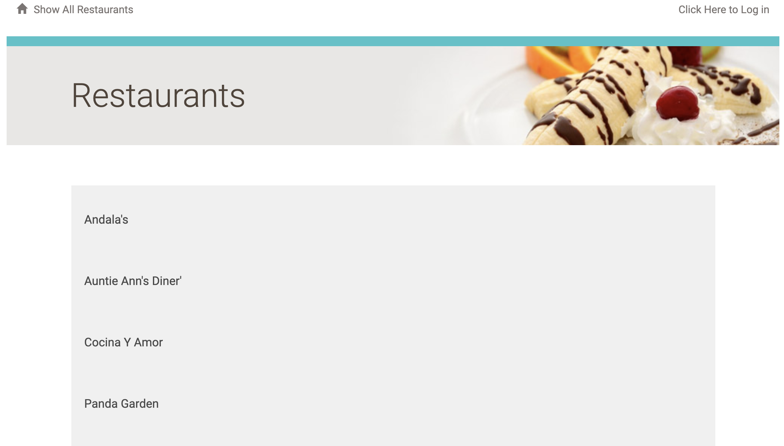
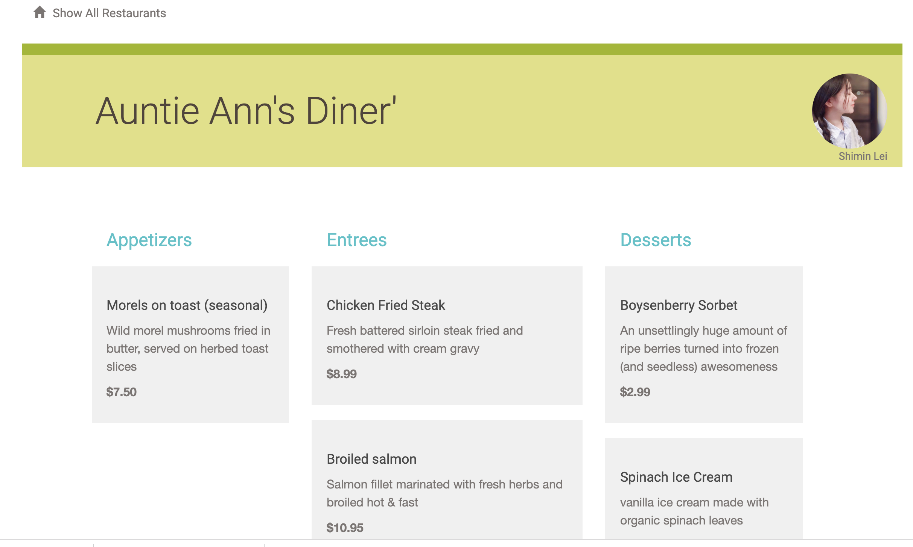
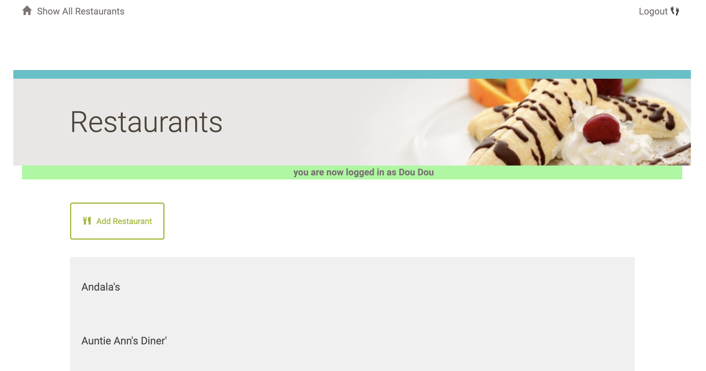
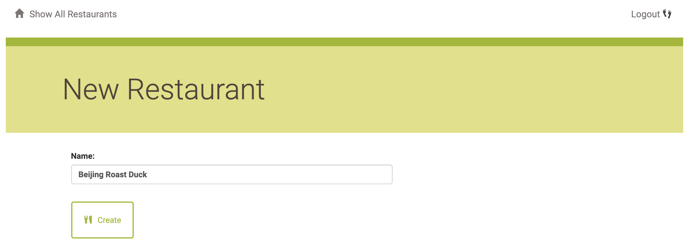
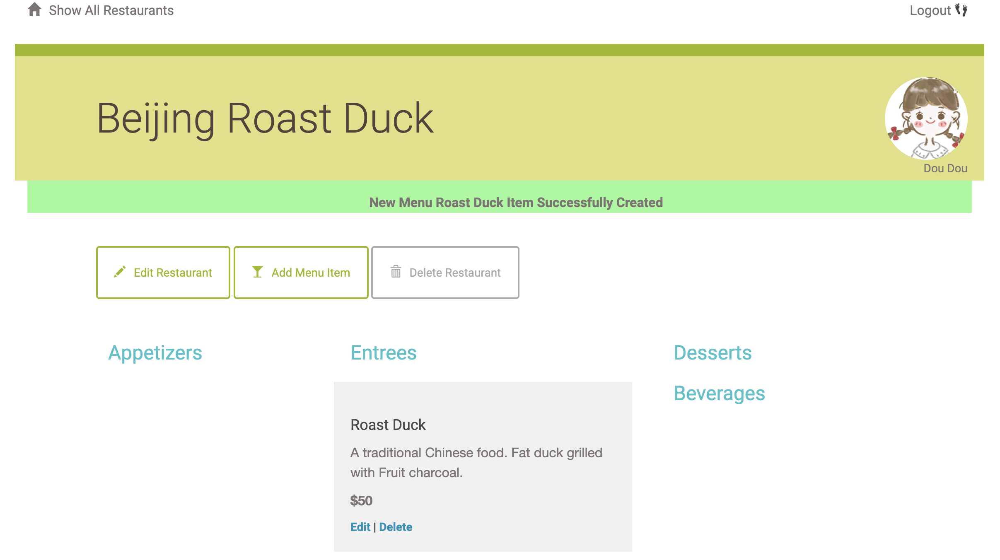
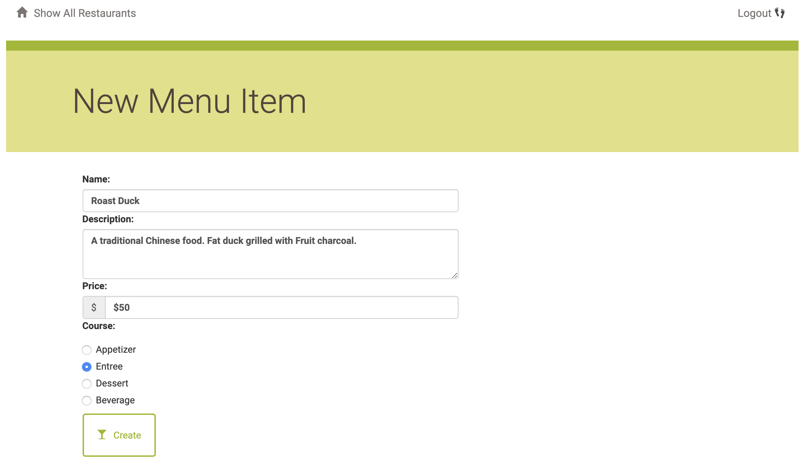

# Description

This is a project made for a Restaurant Menu Website -  http://www.shiminlei.com

- Establish a Restaurant Menu Website which provides a list of restaurants and menus information.
- Provide a user registration and authentication system, support third-party sign-in like Google and Facebook.
- Users can log in and register their own restaurants, and restaurant owner can add or modify the menus information.
- Provide Web APIs with JSON endpoint of all the restaurants and menus.

# Web Presentation

- The main page shows all the restaurants.



- You can click into a restaurant and browse the menus and information. 



- You can login with google account and add your own restaurant.



- Create new restaurant.



- You can edit your own restaurant. 

  You can't change other people's restaurant information.



- Add menus and information including name, description, price and course.




# Requirements

1. Virtual machine - [Vagrant](https://www.vagrantup.com/)
2. [VirtualBox](https://www.virtualbox.org/)
3. [SQLAlchemy](https://www.sqlalchemy.org/) module
4. Flask module
5. Python3 
6. Amazon Lightsail - [Linux Server Configuration](https://github.com/ShiminLei/Linux-Server-Configuration)

# Setup

1. Prepare and configure Amazon Lightsail Linux server.
2. Download [Virtual machine](https://github.com/udacity/fullstack-nanodegree-vm) and setup virtual environment.
3. Install and configure PostgreSQL, prepare the data according to [Data](#data).
4. `sudo pip install -r requirements.txt`.
5. Setup Apache and start the application. In your browser, visit **http://www.shiminlei.com** to view the restaurant menu app. You should be able to view, add, edit, and delete menu items and restaurants. 

# <span id="data">Data</span>

   1. `python database_setup.py` to initialize the database.
   2. `python lotsofitems.py` to  populate the database with restaurants and menu items.

# <span id="view">API</span>

See the JSON of all the restaurant:

```url
http://shiminlei.com/restaurant/JSON
```


See the JSON of certain restaurant:

```url
http://shiminlei.com/restaurant/<int:restaurant_id>/menu/JSON
eg. http://shiminlei.com/restaurant/1/menu/JSON
```
See the JSON of certain menu of certain restaurant:

```url
http://shiminlei.com/restaurant/<int:restaurant_id>/menu/<int:menu_id>/JSON
eg. http://shiminlei.com/restaurant/1/menu/2/JSON
```


